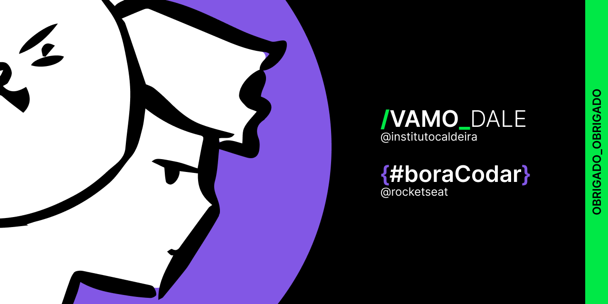

```python
def hello_world():
    print("Olá, mundo! Sou o Mateus, estudante de programação.")
```

> Tenho um espírito inquieto e acredito firmemente na importância da educação acessível a todos.<br>
Através de iniciativas sociais sem fins lucrativos, obtive um amplo *conhecimento* em diversas áreas da tecnologia, e expresso minha *gratidão* às empresas por promoverem esses projetos e por depositarem *esperança* na juventude.
###### METAS DE APRENDIZAGEM
- [x] Suporte de TI
- [ ] Análise de Dados
- [x] Programação Front-end
- [ ] Programação Back-end

`HTML` `CSS` `JavaScript` `Python` `SQL` `Programação em R`
### LEMBRETE!

```markdown
> Mantenha-se focado e determinado.
> Nunca desista de seus sonhos.
```
💜💚

